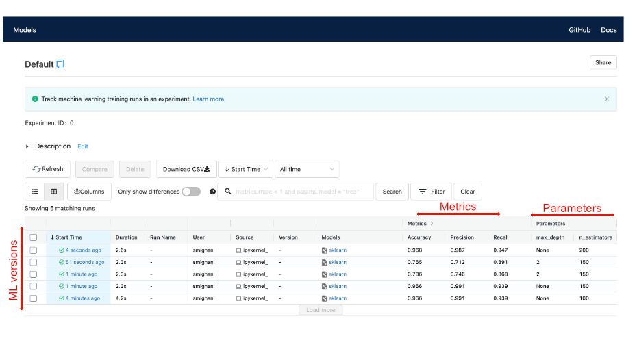

# MLflow: a primer 
## why/how to transform on-premise ML frameworks into a unified one
- Please read the full story at the following published Medium blog post:
[Link](https://medium.com/p/6dfe6be48353/edit)

## one-liner summary: 
By following the exact steps in this repository, you'll be able to simply take your on-premise ML project into MLflow framework.

## What is MLflow useful for?
- Facilitates the ML model versioning during retraining to streamline performance tuning efforts for ML models in production.<br>
- Enhances significantly the ability of Data Science/ML teams in tracking all the ML model repositories; as I jokingly call it the Git's twin brother for the ML models.<br>
- Unifies the entire data cleaning, processing, training lifecycle into a unified single framework.<br>

## Project structure
    
The import, data process, as well as modeling and model versioning were all performed in python. The project directory is structured as follows:
```
mlflow_primer
    
|__ assets/
|__ codes/
|   |__ mlruns/   (*All MLflow runs)
|   |__ ML_refactor_MLflow.ipynb
|__ datasets/
|__ README.md
```
<br>    

An example of the MLflow UI:
<div style="text-align:center"></div>

## Recommendation 
In this post, we went over the benefits and also an example on how to transform any ML model into the MLflow tracker framework.
MLflow has a pretty shallow learning curve if you are already well familiar with the steps in ML model training. 
MLFlow is currently integrated and compatible with multiple cloud platforms, including Spark, GCP, Azure, etc. So, it would be a good candidate to leverage for ML projects in production, at scale.